# SEO Page Creator Agent

**Create production-ready SEO HTML pages from a website URL, without generic AI copy.**

`seo-page-creator-agent` helps teams create pages that are researched, structured, source-aware, and easier to review before publishing. Instead of asking an AI tool for a one-shot blog draft, this agent guides the page through research, planning, drafting, SEO optimization, and quality checks.

Canonical repository: https://github.com/aiapplications001-art/seo-page-creator-agent

[](https://github.com/aiapplications001-art/seo-page-creator-agent/actions/workflows/ci.yml)
[](https://github.com/aiapplications001-art/seo-page-creator-agent/actions/workflows/tests.yml)
[](https://www.npmjs.com/package/seo-page-creator-agent)
[](LICENSE)
[](https://nodejs.org/)

## Canonical Repository

The canonical source for SEO Page Creator Agent is:

https://github.com/aiapplications001-art/seo-page-creator-agent

Package:

https://www.npmjs.com/package/seo-page-creator-agent

Use the canonical repository URL when linking to this project from docs, articles, social posts, package pages, or AI/SEO tool roundups.

## What Is The SEO Page Creator Agent?

SEO Page Creator Agent is an open-source AI SEO content generator and workflow system for creating research-backed SEO pages with AI coding agents such as Codex, Gemini CLI, Antigravity, and Claude-style coding environments.

You can start with **just a website URL**. The agent can inspect the site, understand the business, identify possible SEO page opportunities, research the search results, create a content brief, write the draft, optimize it, and produce a local HTML preview for review.

The final output is not only a prompt response. A run can produce:

- SEO-ready page content;
- a locally hosted HTML preview;
- a content brief;
- a page outline;
- a researched first draft;
- an on-page SEO optimized draft;
- an editorial QA report;
- source and claim-handling notes;
- image/content planning notes when relevant.

The local HTML preview can be opened in a browser, reviewed like a normal web page, and then adapted into your CMS, website theme, or frontend.

## What It Does

SEO Page Creator Agent helps create stronger SEO pages by doing the work in stages:

- understands your website and business context;
- identifies the broad SEO category or cluster;
- finds page opportunities from search results, competitor pages, People Also Ask, related searches, Reddit/forums/videos, and long-tail queries;
- chooses one page opportunity at a time;
- defines what the page should help the reader do;
- checks the real search intent behind the query;
- studies top-ranking competitor pages;
- researches trustworthy topic sources;
- creates a unique angle or useful information-gain asset;
- writes a content brief and page outline;
- drafts the page;
- improves the draft for on-page SEO;
- checks whether the page is specific, useful, evidence-backed, and not generic.

The goal is to create pages that are useful for readers and competitive in search, not thin AI copy with keywords added later.

## How To Use It

Install the package:

```bash
npm install -g seo-page-creator-agent
seo-agent init
```

Then give the agent your website URL.

```text
Website: https://bookmyforex.com
```

That is enough to begin. If the agent needs more information, it can ask follow-up questions such as:

- Which country or market should the page target?
- Are we creating a new page or improving an existing page?
- Is there a specific topic, product, service, or category to focus on?
- Should the output be a local HTML preview, a content packet, or a batch plan?

SEO Page Creator Agent can start from just a website URL. From the site, the agent can infer the brand, business category, visible products or services, sitemap structure, existing content, conversion paths, and possible SEO cluster opportunities.

### Minimum Input

The minimum useful input is:

```text
Website URL
```

Example:

```text
https://bookmyforex.com
```

A target topic, category, market, or page URL improves precision, but the workflow is designed so the agent can infer as much as possible from the website and ask only for missing decisions it cannot safely infer.

Useful optional inputs:

- target market;
- language;
- topic;
- keyword;
- competitor URLs;
- existing page URL to refresh;
- number of pages to create;
- desired output format.

### Example Input

```text
Website: https://bookmyforex.com
Market: India
Topic: forex cards for international students
Goal: create one local SEO page and HTML preview
```

### Example Output

At the end, you can review a local HTML page in your browser.

The preview may include:

- a clear page title;
- a quick answer near the top;
- detailed researched sections;
- comparison tables or decision matrices;
- examples;
- mistakes to avoid;
- FAQs;
- next-step guidance;
- source-aware claim handling.

Example page shape:

```text
Best Forex Card For Indian Students Going Abroad From India

Quick Answer
For most Indian students going abroad, the best forex card is not simply the card with the lowest joining fee. A safer choice depends on destination currency, reload speed, ATM-use pattern, university payment needs, emergency support, and refund rules.

Student Forex Card Fit Matrix

Student situation:
Going to the US, UK, Canada, Europe, or Australia

What matters most:
Destination-currency support and reload reliability

What to compare:
Currency support, reload time, exchange-rate markup, and ATM withdrawal fee

Safer next step:
Shortlist cards around your destination currency first, then compare fees.
```

Behind the scenes, a completed local run can save supporting files such as the content brief, outline, draft, SEO-optimized copy, QA report, source notes, and local preview:

```text
.seo-agent-workspace/
  page-packets/forex-card-comparison/P1/
    page-packet.md
    page-packet.json
    page-packet.expanded.md
    image-manifest.json
  html-preview/
    forex-card-comparison/P1/index.html
  v2/page-packets/forex-card-comparison/P1/
    seo-content-brief.md
    seo-page-outline.md
    seo-first-draft.md
    on-page-seo-optimized-draft.md
    editorial-qa-report.md
    debug-bundle.md
```

## Who Is It For?

SEO Page Creator Agent is for:

- SEO agencies producing client content;
- in-house SEO and content teams;
- programmatic SEO teams;
- developers building AI-assisted content workflows;
- editors who need source-backed drafts;
- brands in sensitive, local, evidence-heavy, or comparison-heavy categories.

It is especially useful when pages must stay aligned with a specific business, market, audience, product category, search intent, and conversion journey.

## Project Status

SEO Page Creator Agent is in early public release and currently supports the workflow from category discovery through on-page SEO optimization.

- Current package version: `0.1.0`
- Runtime: Node.js 22+
- Package: `seo-page-creator-agent`
- CLI command: `seo-agent`
- Language: TypeScript
- License: Apache-2.0
- Validation command: `npm run validate`
- Test command: `npm test`
- Supported adapters: Codex, Gemini CLI, and Antigravity
- Current workflow coverage: category discovery through Step 11 on-page SEO optimization
- Remaining roadmap: Step 12 trust/authority, metadata finalization, final QA, publishing readiness, richer examples, and broader adapter parity

## Inside The Agent: What Happens Behind The Scenes

```mermaid
flowchart LR
  classDef user fill:#EEF6FF,stroke:#2563EB,color:#0F172A,stroke-width:1.4px;
  classDef system fill:#F8FAFC,stroke:#64748B,color:#111827,stroke-width:1.2px;
  classDef research fill:#ECFDF5,stroke:#059669,color:#064E3B,stroke-width:1.2px;
  classDef content fill:#FFF7ED,stroke:#EA580C,color:#7C2D12,stroke-width:1.2px;
  classDef qa fill:#FEF2F2,stroke:#DC2626,color:#7F1D1D,stroke-width:1.2px;
  classDef output fill:#F5F3FF,stroke:#7C3AED,color:#2E1065,stroke-width:1.8px;

  subgraph User["User"]
    direction TB
    U1["Install package"]
    U2["Run seo-agent init"]
    U3["Enter website URL"]
    U4["Optional context: market, topic, competitor, page URL"]
  end

  subgraph Internal["Internal System"]
    direction LR

    subgraph Understand["Understand"]
      direction TB
      I1["Website and sitemap scan"]
      I2["Business, audience, market, and conversion-path inference"]
      I3["Category discovery and cluster strategy"]
    end

    subgraph Research["Research And Strategy"]
      direction TB
      I4["Workflow gates: Step 0A through Step 7"]
      I5["SERP, competitor, audience-language, and topic research"]
      I6["Unique angle and information-gain asset"]
    end

    subgraph Create["Create"]
      direction TB
      I7["SEO content brief"]
      I8["Page outline"]
      I9["First draft and on-page SEO optimization"]
    end

    subgraph Validate["Validate And Package"]
      direction TB
      I10["Schemas, hashes, repair loops, page locks, and QA gates"]
      I11["Internal artifacts: Markdown, JSON, editorial QA, debug bundle, image/content manifest"]
      I12["HTML preview renderer"]
    end
  end

  subgraph Output["External Output"]
    direction TB
    O1["Locally hosted HTML review"]
  end

  U1 --> U2 --> U3
  U4 -.-> U3
  U3 --> I1
  I1 --> I2 --> I3
  I3 --> I4 --> I5 --> I6
  I6 --> I7 --> I8 --> I9
  I9 --> I10 --> I11 --> I12
  I12 --> O1

  class U1,U2,U3,U4 user;
  class I1,I2,I3 system;
  class I4,I5,I6 research;
  class I7,I8,I9 content;
  class I10,I11,I12 qa;
  class O1 output;
```



## Supported AI Coding Agents

SEO Page Creator Agent is host-agent-first.

The TypeScript package provides:

- CLI commands;
- schemas;
- validators;
- workflow contracts;
- artifact paths;
- adapter instructions;
- deterministic checks.

The host AI coding agent performs:

- live SERP research;
- competitor review;
- audience-language research;
- topic research;
- artifact completion;
- drafting;
- repair;
- page implementation when configured.

Supported adapter paths include:

- Codex
- Gemini CLI
- Antigravity
- Claude-style coding agents that can follow the same workflow contracts manually

Recommended host capabilities:

- filesystem access;
- terminal access;
- web/search access;
- JSON discipline;
- ability to run validation commands;
- ability to work page-by-page without batching multiple pages at the same stage.

## AI Overview And Search-Friendly Output

The workflow is designed to help create content that is useful for both readers and search systems.

It encourages:

- concise answer blocks;
- visible main-intent answers near the top;
- natural query coverage;
- evidence-backed sections;
- FAQs where relevant;
- original information-gain assets;
- clear "why this page deserves to compete" summaries;
- source and claim-sensitivity handling.

AI Overview signals may be used as answer-shape clues when visible, but they are not treated as factual authority and should not be copied.

## Workflow Gates

SEO Page Creator Agent uses a gated workflow so pages do not move directly from keyword to generic draft.

Current workflow coverage includes:

- Category Discovery: infer the SEO cluster from website, business, SERP, competitor, and audience-language evidence.
- Step 0A: define topic, search problem, and natural problem-language.
- Step 0B: freeze target keyword, query cluster, and page scope.
- Step 1: define the page's job.
- Step 2: validate search intent and expected depth.
- Step 3: choose page type and internal content format.
- Step 4: define the next reader action.
- Step 5: analyze SERP and competitors.
- Step 6: research the topic deeply.
- Step 7: define unique angle and information gain.
- Step 8: create the SEO content brief.
- Step 9: build the outline.
- Step 10: write the first draft.
- Step 11: optimize on-page SEO.

Each major gate creates structured JSON and Markdown artifacts with hashes, verdicts, blockers, warnings, repair logs, and must-carry-forward requirements.

### Advanced CLI Helpers

Useful lower-level commands include:

```bash
seo-agent category init --site https://example.com --company "Example" --market India
seo-agent category validate --run-id <run-id>
seo-agent cluster plan --auto-discover --run-id <run-id> --company "Example"
seo-agent v2 prepare-page --cluster <cluster-slug> --page-id P1 --page-type guide
seo-agent v2 validate-depth --cluster <cluster-slug> --page-id P1
seo-agent v2 qa --cluster <cluster-slug> --page-id P1
```

When a V2 workspace exists, the host adapter fills `final-copy-draft.json` with evidence-backed prose before final expansion. The editor-facing deliverables remain the final page packet, editorial QA report, and image manifest.

### Advanced Quality Contracts

SEO Page Creator Agent includes an Intent-Aware Page Structure contract. Page sections must carry page-specific `sectionIntent` and `evidenceBudget` expectations instead of relying on one fixed body template.

The `pre-draft-quality-brief.json` artifact checks publish-worthiness before prose is written. It includes the SERP Superiority Gate and the Research-Derived Structure Gate. The research-derived structure plan is stored as `researchDerivedStructurePlan`, and final copy must include `structurePlanDeliveryProof`.

For competitive pages, the SERP Superiority Gate expects primary keyword top 5 SERP pages, a secondary keyword or long-tail top 3 SERP set, the top 4 intent dimensions, at least 1 required superiority component, and 5 differentiated visible improvements. Final prose must include `superiorityProof`, `whyThisDeservesToRank`, and traceable `sourceRefs`.

Opportunity selection prioritizes unfocused and long-tail search opportunities where the page can add real information gain. The agent should use SERP, PAA, Reddit/forum/video, AI Overview, audience-language, and competitor-gap research to avoid generic page structures and shallow copy.

## Batch And Live Publishing

Batch publishing is page-by-page, not stage-by-stage.

A batch run must complete one page fully before starting the next page:

```text
select opportunity
-> research
-> brief
-> outline
-> draft
-> optimize
-> QA
-> repair
-> commit
-> deploy
-> verify live URL
-> next page
```

This prevents the common failure where an agent creates assets for many pages first, writes copy for many pages second, and loses progress if the session fails.

Batch runs persist state under:

```text
.seo-agent-workspace/batch-runs/<run-id>/
  batch-run.json
  run-ledger.jsonl
  current-page.lock
```

Content and structure uniqueness are required across the batch and across historical runs. A page must fail repair if it reuses one shared HTML body template, repeats a same body section pattern, or differs only by title, slug, hook, or paraphrase.

Live publishing requires a project-specific publishing playbook, repo/CMS access, deployment instructions, and live URL verification. Without those, the default output is local SEO content and a local HTML preview.

## Contributing

Contributions are welcome when they preserve the project's evidence, safety, and repeatability standards.

Start with [CONTRIBUTING.md](CONTRIBUTING.md), run validation before opening a pull request, and update tests, docs, and adapters when workflow behavior changes.

```bash
npm run validate
```

## Security

Do not open public issues for vulnerabilities or accidentally exposed credentials. Read [SECURITY.md](SECURITY.md) for reporting guidance and sensitive-data rules.

## License

Apache-2.0
